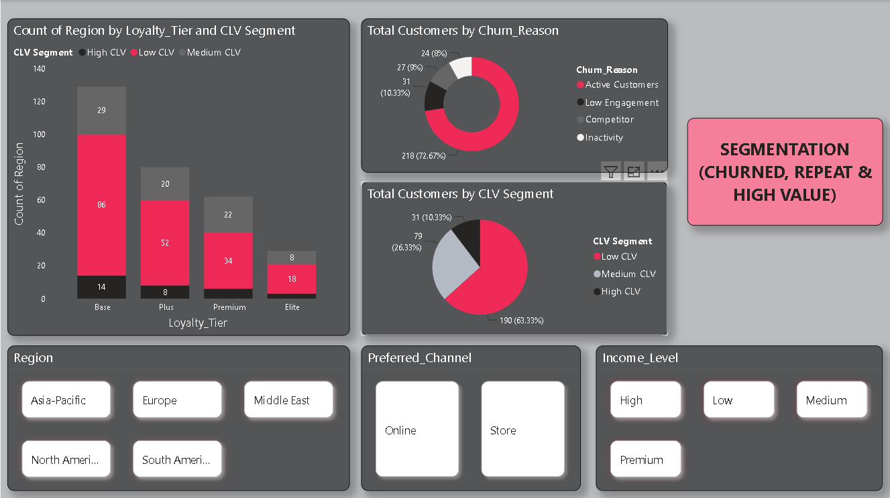

# Adidas Retail Customer Retention Analytics

## Project Overview

This Power BI project analyzes customer retention patterns for Adidas retail operations. The dashboard provides insights into customer churn, customer lifetime value (CLV), loyalty program effectiveness, repeat purchase behavior, and store performance.

## Business Problem

Customer retention is critical for long-term business growth. Adidas wanted to identify factors influencing customer churn and evaluate the effectiveness of loyalty programs, promotions, and sales channels.

## Tools Used

- Power BI
- DAX
- Power Query
- Excel

## Key Metrics

- Churn Rate
- Customer Lifetime Value (CLV)
- Repeat Customers
- Retention Rate
- Promotion Impact
- Loyalty Tier Performance

## Dashboard Preview

## Key Analysis Areas

- Customer Churn Analysis
- Customer Retention Metrics
- Repeat Purchase Analysis
- Loyalty Program Effectiveness
- Promotion Impact Analysis
- Store Performance Analysis
- Customer Segmentation

## Skills Demonstrated

- Data Cleaning
- Data Modeling
- DAX Calculations
- Data Visualization
- Business Intelligence
- Customer Analytics
- Churn Analysis
